<picture><source media="(prefers-color-scheme: dark)" srcset="assets/dark/header.svg"/></picture>

<a href="https://github.com/MohammedYessineKraiem"><picture><source media="(prefers-color-scheme: dark)" srcset="https://img.shields.io/badge/GITHUB-0A0000?style=for-the-badge&logo=github&logoColor=e0334a"/></picture></a>
<a href="https://www.linkedin.com/in/mohammed-yessine-kraiem-40302440b"><picture><source media="(prefers-color-scheme: dark)" srcset="https://img.shields.io/badge/LINKEDIN-0A0000?style=for-the-badge&logo=linkedin&logoColor=e0334a"/></picture></a>
<a href="mailto:moyesskr@gmail.com"><picture><source media="(prefers-color-scheme: dark)" srcset="https://img.shields.io/badge/EMAIL-0A0000?style=for-the-badge&logo=gmail&logoColor=e0334a"/></picture></a>
<a href="https://MYessineKr.me"><picture><source media="(prefers-color-scheme: dark)" srcset="https://img.shields.io/badge/PORTFOLIO-0A0000?style=for-the-badge&logo=firefoxbrowser&logoColor=e0334a"/></picture></a>

<picture><source media="(prefers-color-scheme: dark)" srcset="assets/dark/now-ticker.svg"/></picture>

<picture><source media="(prefers-color-scheme: dark)" srcset="assets/dark/s01.svg"/></picture>
<picture><source media="(prefers-color-scheme: dark)" srcset="assets/dark/whoami.svg"/></picture>

<picture><source media="(prefers-color-scheme: dark)" srcset="assets/dark/s02.svg"/></picture>
<picture><source media="(prefers-color-scheme: dark)" srcset="assets/dark/expertise-bars.svg"/></picture>

<picture><source media="(prefers-color-scheme: dark)" srcset="assets/dark/s03.svg"/></picture>
<picture><source media="(prefers-color-scheme: dark)" srcset="assets/dark/ecosystem.svg"/></picture>

<picture><source media="(prefers-color-scheme: dark)" srcset="assets/dark/s04.svg"/></picture>
<picture><source media="(prefers-color-scheme: dark)" srcset="assets/dark/projects.svg"/></picture>

<picture><source media="(prefers-color-scheme: dark)" srcset="assets/dark/s05.svg"/></picture>
<picture><source media="(prefers-color-scheme: dark)" srcset="assets/dark/timeline.svg"/></picture>

<picture><source media="(prefers-color-scheme: dark)" srcset="assets/dark/s06.svg"/></picture>
<picture><source media="(prefers-color-scheme: dark)" srcset="assets/dark/experience.svg"/></picture>

<picture><source media="(prefers-color-scheme: dark)" srcset="assets/dark/s07.svg"/></picture>
<picture><source media="(prefers-color-scheme: dark)" srcset="assets/dark/telemetry.svg"/></picture>
<picture><source media="(prefers-color-scheme: dark)" srcset="assets/dark/github-stats-custom.svg"/></picture>

<picture><source media="(prefers-color-scheme: dark)" srcset="assets/generated/stats-dark.svg"/></picture>
<picture><source media="(prefers-color-scheme: dark)" srcset="assets/generated/top-langs-dark.svg"/></picture>

<picture><source media="(prefers-color-scheme: dark)" srcset="assets/generated/activity-graph-dark.svg"/></picture>

<picture><source media="(prefers-color-scheme: dark)" srcset="assets/generated/streak-dark.svg"/></picture>
<picture><source media="(prefers-color-scheme: dark)" srcset="assets/generated/trophy-dark.svg"/></picture>

<picture><source media="(prefers-color-scheme: dark)" srcset="assets/dark/s08.svg"/></picture>
<picture><source media="(prefers-color-scheme: dark)" srcset="assets/dark/stack.svg"/></picture>

 

 

<picture><source media="(prefers-color-scheme: dark)" srcset="assets/dark/s09.svg"/></picture>
<picture><source media="(prefers-color-scheme: dark)" srcset="assets/dark/certs.svg"/></picture>

<picture><source media="(prefers-color-scheme: dark)" srcset="assets/dark/philosophy.svg"/></picture>

<picture><source media="(prefers-color-scheme: dark)" srcset="assets/generated/quote-dark.svg"/></picture>

<picture><source media="(prefers-color-scheme: dark)" srcset="assets/generated/weather-dark.svg"/></picture>
<picture><source media="(prefers-color-scheme: dark)" srcset="assets/generated/snake-dark.svg"/></picture>

<!--GUESTBOOK:START-->

**Guestbook** — [leave a note &#8594;](https://github.com/MohammedYessineKraiem/MohammedYessineKraiem/issues/new?title=Guestbook)

*no entries yet — be the first.*

<!--GUESTBOOK:END-->

<picture><source media="(prefers-color-scheme: dark)" srcset="assets/dark/footer.svg"/></picture>

<!-- one responsive picture per visual; light/dark switched via prefers-color-scheme -->
